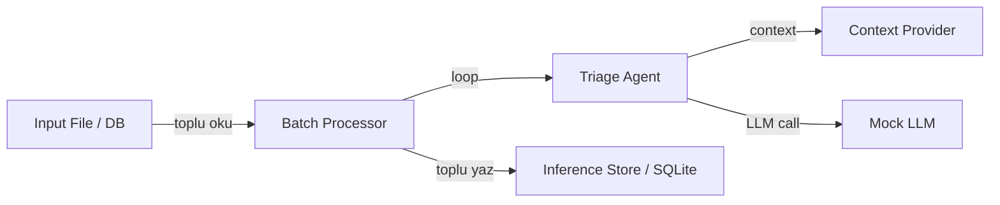

# Batch Deployment

> Ticket'ları toplu olarak oku, agent ile işle, sonuçları kaydet.

---

## Ne Zaman Batch Kullanılır?

- Anlık cevap gerekmiyorsa
- Veriler toplu olarak birikiyorsa
- Maliyet optimize edilmek isteniyorsa (off-peak saatlerde çalıştır)
- Tüm veriye erişim gerekiyorsa

## Mimari



## Çalıştırma

```bash
# Repo kök dizininden
python -m batch.app.processor

# Veya Makefile ile
make run-batch
```

## Dosya Yapısı

```
batch/
├── app/
│   ├── __init__.py
│   └── processor.py      # Ana batch işleme motoru
├── tests/
│   └── test_batch.py     # Batch testleri
├── Dockerfile
└── README.md
```

## Akış

1. `load_tickets_from_file()` → JSON dosyasından ticket'ları oku
2. `process_all()` → Her ticket'ı sırayla agent'a gönder
3. Agent her ticket için: context çek → LLM çağır → sonuç üret
4. `store.save_batch()` → Tüm sonuçları tek transaction'da yaz

## Production'da Ne Değişir?

| Bu Repo | Production |
|---|---|
| JSON dosyadan okuma | DB query / S3 |
| Sıralı işleme | Paralel (multiprocessing) |
| Basit logging | Structured logging + metrics |
| Tek çalıştırma | Kubernetes CronJob / Airflow DAG |
| Tüm batch ya da hiç | Checkpoint ile kaldığı yerden devam |

## Trade-offs

**Avantajlar:**
- En basit deployment modeli
- Maliyet optimizasyonu (off-peak kaynaklar, bulk API fiyatları)
- Debug kolay (log dosyasını incele)
- Yeniden çalıştırma kolay

**Dezavantajlar:**
- Yüksek latency (sonuçlar saatler sonra hazır)
- Stale data riski (işlerken veri değişebilir)
- All-or-nothing (hata tüm batch'i etkileyebilir)
