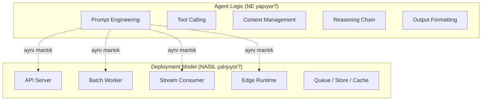

# Agent Logic vs Deployment Model

> Bu doküman, AI mühendisliğindeki en kritik ayrımlardan birini açıklar: **agent'ın ne yaptığı** ile **nasıl çalıştırıldığı** arasındaki fark.

---

## İki Farklı Dünya



### Agent Logic

Agent logic, **iş problemini çözen** kısımdır:

- Bir ticket'ı oku ve anla
- Geçmiş context'i bul
- Öncelik belirle (P0, P1, P2, P3)
- Kategori ata (bug, feature request, question)
- Özet oluştur

Bu mantık **runtime ortamından bağımsızdır.** Aynı agent logic'i bir API'nin içinde de çalıştırabilirsin, bir cron job'ın içinde de.

### Deployment Model

Deployment model, **agent'ın nasıl tetiklendiğini, veriyi nereden aldığını ve sonucu nereye yazdığını** belirler:

- Input nereden geliyor? (HTTP request, dosya, event bus, lokal input)
- Ne kadar hızlı olmalı? (ms, saniye, dakika)
- Hata olduğunda ne yapılır? (retry, dead letter, graceful degrade)
- Scale nasıl yapılır? (horizontal, partition, per-device)

---

## Neden Bu Ayrım Önemli?

### 1. Tekrar Kullanılabilirlik

Agent logic'i deployment'tan ayırırsan, aynı agent'ı farklı ortamlarda yeniden kullanabilirsin:

```python
# Aynı agent, farklı deployment'lar
agent = TicketTriageAgent(llm=mock_llm, context_store=context)

# Batch'te
for ticket in bulk_tickets:
    result = agent.process(ticket)
    store.save(result)

# Real-time'da
@app.post("/triage")
async def triage(ticket: Ticket):
    result = agent.process(ticket)
    return result

# Stream'de
for event in event_stream:
    ticket = parse_event(event)
    result = agent.process(ticket)
    store.save(result)
```

### 2. Test Edilebilirlik

Agent logic'i izole test edebilirsin — deployment altyapısına ihtiyaç duymadan:

```python
def test_triage_assigns_high_priority():
    agent = TicketTriageAgent(llm=MockLLM())
    ticket = Ticket(title="Production down", body="All services 500")
    result = agent.process(ticket)
    assert result.priority == Priority.P0
```

### 3. Evrim

Sistem büyüdükçe deployment modelin değişir ama agent logic'in aynı kalabilir:

```
Başlangıç:  Batch cron job (günde 1 kere)
Büyüme:     Stream consumer (gerçek zamana yakın)
Olgunluk:   Real-time API + Stream + Batch hibrit
```

Her aşamada agent logic'in değişmesi gerekmez — sadece "çevresindeki" deployment katmanı evrilir.

---

## Analoji

Bunu bir mutfak analojisi ile düşün:

| Kavram | Mutfak Karşılığı |
|---|---|
| Agent Logic | Yemek tarifi |
| Deployment Model | Mutfağın düzeni (ev mutfağı vs endüstriyel mutfak vs food truck) |
| LLM | Fırın |
| Context Store | Buzdolabı |
| Input | Malzemeler |
| Output | Servis edilen yemek |

Aynı tarifi ev mutfağında da, endüstriyel mutfakta da, food truck'ta da yapabilirsin. Tarif aynı, ama:
- Ev mutfağında 4 porsiyon yaparsın (batch, küçük ölçek)
- Endüstriyel mutfakta 500 porsiyon yaparsın (stream/batch, büyük ölçek)  
- Food truck'ta sipariş gelince hemen yaparsın (real-time)
- Piknikte sınırlı malzemeyle yaparsın (edge)

---

## Bu Repo'da Bu Ayrım Nasıl Görünür?

```
shared/                        ← AGENT LOGIC burada yaşar
├── models/base_agent.py       ← Ortak agent soyutlaması
├── schemas/ticket.py          ← Veri modelleri
├── prompts/triage.py          ← Prompt template'leri
└── utils/context.py           ← Context retrieval

batch/app/                     ← DEPLOYMENT MODEL: Batch
stream/app/                    ← DEPLOYMENT MODEL: Stream
realtime/app/                  ← DEPLOYMENT MODEL: Real-time
edge/app/                      ← DEPLOYMENT MODEL: Edge
```

Her deployment klasörü, `shared/` içindeki agent logic'i import eder ve kendi runtime ortamına göre sarar.

---

## Interview / Sistem Tasarımı Dersi

Bir sistem tasarımı mülakatında şu soruyu alabilirsin:

> "Design an AI-powered ticket triage system"

Doğru cevap tek bir mimari değildir. Doğru cevap şu soruları sormaktır:

1. Ticket'lar ne sıklıkla geliyor? (Throughput ihtiyacı)
2. Kullanıcı ne kadar hızlı sonuç bekliyor? (Latency ihtiyacı)
3. Offline çalışması gerekiyor mu? (Edge ihtiyacı)
4. Verinin gizliliği önemli mi? (Privacy constraint)
5. Maliyetin bütçesi ne? (Cost constraint)

Cevaplara göre deployment modelin (veya hibrit kombinasyonun) şekillenir — ama agent logic temelde aynı kalır.

---

## Özet

```
┌──────────────────────────────────────────────┐
│                                              │
│   Agent Logic = NE yapıyor                   │
│   (prompt, reasoning, tools, output)         │
│                                              │
│   Deployment Model = NASIL çalışıyor         │
│   (API, batch, stream, edge, queue, store)   │
│                                              │
│   İkisini ayır → Güçlü mühendislik          │
│                                              │
└──────────────────────────────────────────────┘
```
