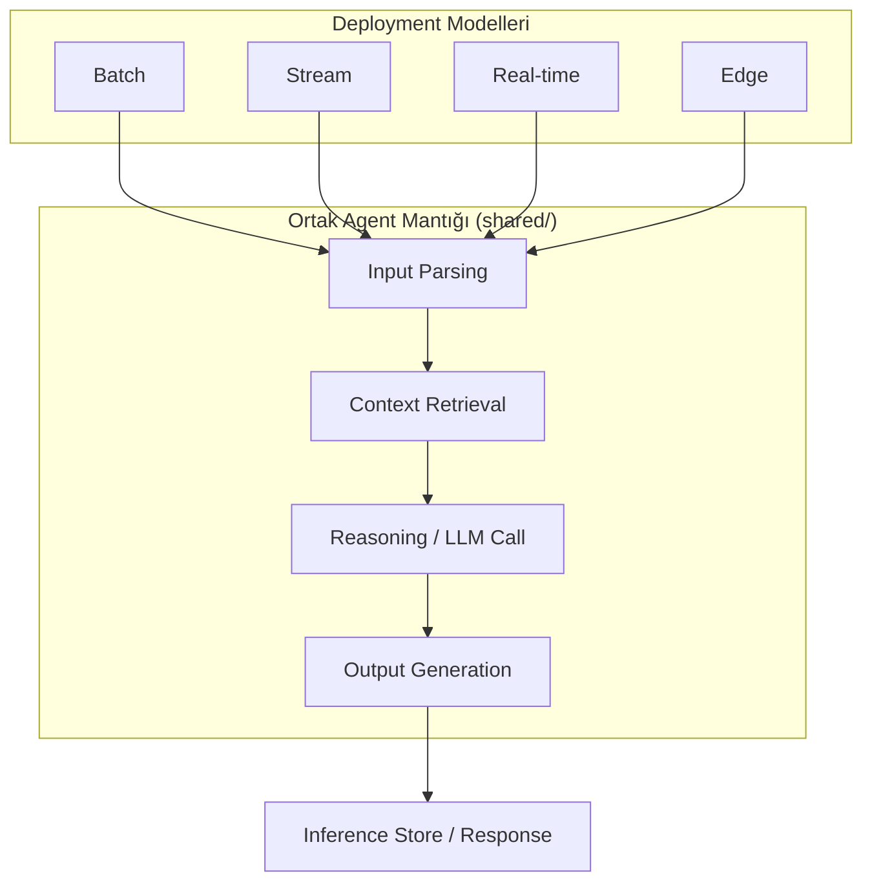
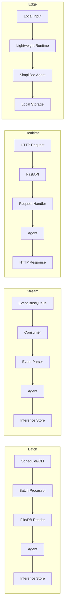
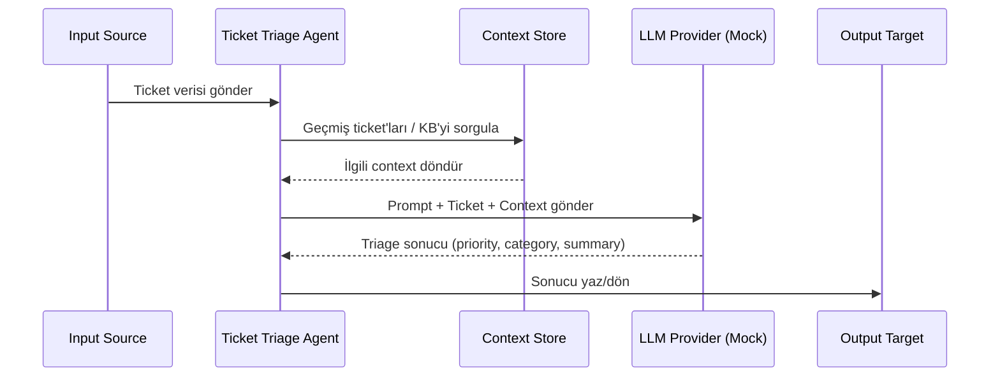

# Architecture Overview

> Bu doküman, agent-deployment-playground'un sistem tasarımını eğitim amaçlı açıklar.

---

## Büyük Resim

Bu repo'nun temel fikri basittir: **aynı iş mantığı (ticket triage), farklı runtime ortamlarında farklı mimari kararlar gerektirir.**



**Önemli:** Agent mantığı her yerde aynıdır. Değişen şey:
- Input nereden gelir?
- Output nereye gider?
- Ne kadar hızlı olmalı?
- Hangi kaynaklara erişebilir?

---

## Katmanlı Mimari

Proje 3 temel katmandan oluşur:

### 1. Shared Layer (shared/)

Tüm deployment modelleri tarafından paylaşılan ortak katman:

```
shared/
├── schemas/          # Pydantic modelleri — input, output, event tanımları
│   ├── ticket.py     # Ticket veri modeli
│   └── result.py     # Agent çıktı modeli
├── models/           # Agent soyutlamaları
│   ├── base_agent.py # Abstract agent sınıfı
│   └── mock_llm.py   # Mock LLM provider
├── prompts/          # Prompt template'leri
│   └── triage.py     # Ticket triage prompt'u
├── types/            # Enum ve tip tanımları
│   └── enums.py      # Priority, Category enum'ları
└── utils/            # Yardımcı fonksiyonlar
    ├── context.py    # Context retrieval
    └── store.py      # Inference store abstraction
```

**Neden bu kadar ayrılmış?**

Çünkü gerçek dünyada agent logic, deployment'tan bağımsız olarak test edilebilir ve geliştirilebilir olmalıdır. Bu ayrım "separation of concerns" ilkesinin agent dünyasındaki yansımasıdır.

### 2. Deployment Layer (batch/, stream/, realtime/, edge/)

Her deployment modeli kendi klasöründe yaşar ve shared layer'ı kullanır:



### 3. Infrastructure Layer

Queue, database, API gateway gibi altyapı bileşenleri. Bu repo'da bunlar simüle edilir:

| Gerçek Dünya | Bu Repo'daki Simülasyon |
|---|---|
| Kafka / RabbitMQ | In-memory queue veya dosya tabanlı |
| PostgreSQL | SQLite |
| Redis | In-memory dict |
| API Gateway | Doğrudan FastAPI |
| Kubernetes CronJob | Python scheduler |

---

## Agent Flow (Tüm Modeller İçin Ortak)



### Agent'ın Yaptığı İş

1. **Input Parsing:** Gelen veriyi (ticket) standart bir formata çevir
2. **Context Retrieval:** İlgili ek bilgiyi getir (geçmiş ticket'lar, knowledge base)
3. **Reasoning:** LLM'e prompt + ticket + context gönder, triage kararı al
4. **Output Generation:** Sonucu hedefe yaz (store, response, local file)

---

## Veri Akışı Karşılaştırması

### Batch

```
[Dosya/DB] ──bulk read──→ [Batch Processor] ──loop──→ [Agent] ──bulk write──→ [Inference Store]
                                                         ↑
                                                    Context Store
```

- **Tetikleyici:** Zamanlayıcı (cron) veya manuel CLI komutu
- **Input:** Toplu veri (dosya, DB query)
- **Output:** Toplu yazım (bulk insert)
- **Latency beklentisi:** Dakikalar-saatler
- **Hata stratejisi:** Başarısız kayıtları logla, başarılıları yaz, tekrar dene

### Stream

```
[Event Bus] ──event──→ [Consumer] ──one-by-one──→ [Agent] ──write──→ [Inference Store]
                                                      ↑
                                                 Context Store
```

- **Tetikleyici:** Yeni event (ticket oluşturma, güncelleme)
- **Input:** Tek event
- **Output:** Tek kayıt yazımı
- **Latency beklentisi:** Saniyeler
- **Hata stratejisi:** Dead letter queue, idempotent processing

### Real-time

```
[HTTP Client] ──request──→ [FastAPI] ──→ [Agent] ──→ [Response]
                                            ↑
                                       Context Store
```

- **Tetikleyici:** Kullanıcı HTTP isteği
- **Input:** Tek request payload
- **Output:** HTTP response
- **Latency beklentisi:** Milisaniyeler (100-500ms ideal)
- **Hata stratejisi:** Timeout, retry, circuit breaker

### Edge

```
[Local Input] ──→ [Lightweight Agent] ──→ [Local Storage]
                        ↑
                   Local Cache (sınırlı context)
```

- **Tetikleyici:** Lokal olay veya kullanıcı etkileşimi
- **Input:** Cihaz üzeri veri
- **Output:** Lokal dosya veya display
- **Latency beklentisi:** Milisaniyeler (< 50ms)
- **Hata stratejisi:** Graceful degradation, fallback kuralları

---

## Mimari Kararların Ardındaki "Neden"ler

### Neden Mock LLM?

Bu repo deployment pattern'leri öğretir, LLM entegrasyonunu değil. Mock LLM:
- Test edilebilirlik sağlar
- API key gerektirmez
- Deterministic sonuçlar verir
- Farklı provider'lara geçiş yapmayı kolaylaştıran abstraction'ı gösterir

### Neden SQLite?

Production'da PostgreSQL veya benzeri bir DB kullanırsın. SQLite:
- Sıfır kurulum gerektirir
- Inference store kavramını öğretmek için yeterlidir
- `pip install` ile gelir

### Neden Simüle Edilmiş Queue?

Kafka/RabbitMQ kurulumu bu repo'nun amacını aşar. Ama stream pattern'ini anlamak için queue davranışını simüle etmek yeterlidir.

---

## Production'a Geçerken Ne Değişir?

| Bu Repo | Production |
|---|---|
| Mock LLM | OpenAI, Anthropic, yerel model |
| SQLite | PostgreSQL, DynamoDB |
| In-memory queue | Kafka, RabbitMQ, SQS |
| Dosya tabanlı input | S3, event bus, webhook |
| Tek process | Kubernetes, ECS, Lambda |
| stdout logging | Structured logging + tracing |
| Basit retry | Exponential backoff + circuit breaker |
| Manuel test | CI/CD + integration tests |
