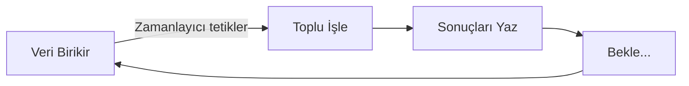
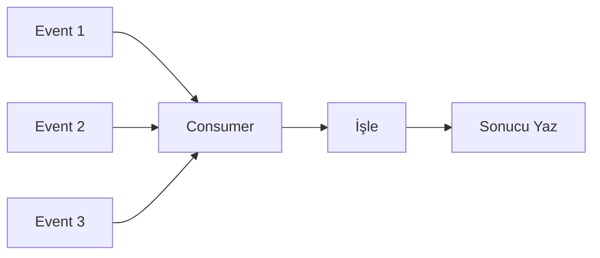
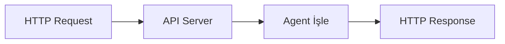
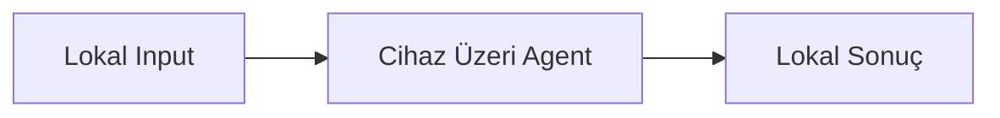

# Batch vs Stream vs Real-time vs Edge: Detaylı Karşılaştırma

> Bu doküman, 4 deployment modelini derinlemesine karşılaştırır.

---

## Her Model Ne Zaman Doğar?

Her deployment modeli belirli bir ihtiyaçtan doğar. Hiçbiri "daha iyi" değildir — sadece farklı problemlere cevap verir.

### Batch: "Biriktirilmiş işi toptan halledeyim"



**Doğduğu an:** Müşteri destek yöneticisi diyor ki "Her sabah, dünkü tüm ticket'ların özetini ve öncelik sıralamasını görmek istiyorum."

**Tipik kullanım:**
- Gece çalışan enrichment job'ları
- Günlük raporlama
- Toplu veri işleme pipeline'ları
- ML model eğitimi (training)

**Kod yapısı:**
```python
def run_batch():
    tickets = load_all_pending_tickets()      # Toplu oku
    for ticket in tickets:                     # Sırayla işle
        result = agent.process(ticket)
        store.save(result)
    log_summary(total=len(tickets))            # Rapor ver
```

---

### Stream: "Her event geldiğinde hemen tepki vereyim"



**Doğduğu an:** Sistem mühendisi diyor ki "Yeni bir ticket oluşturulduğunda 30 saniye içinde kategorize edilmeli ve doğru takıma atanmalı."

**Tipik kullanım:**
- Event-driven ticket routing
- Real-time alerting
- Log processing
- CDC (Change Data Capture) pipeline'ları

**Kod yapısı:**
```python
async def consume_events():
    async for event in event_stream:           # Sürekli dinle
        ticket = parse_event(event)
        result = agent.process(ticket)
        store.save(result)
        await event.acknowledge()              # İşlendiğini bildir
```

---

### Real-time: "Kullanıcı soruyor, hemen cevap vereyim"



**Doğduğu an:** Ürün yöneticisi diyor ki "Kullanıcı ticket yazdığında, submit butonuna bastığı anda kategorisini ve önerilen priority'yi görsün."

**Tipik kullanım:**
- Chatbot / conversational AI
- Anlık sınıflandırma API
- Karar destek sistemi
- Auto-complete / suggestion

**Kod yapısı:**
```python
@app.post("/triage")
async def triage_ticket(request: TriageRequest):
    ticket = request.to_ticket()
    result = agent.process(ticket)             # Anında işle
    return TriageResponse.from_result(result)  # Anında dön
```

---

### Edge: "İnternetsiz, hızlı, gizli çalışayım"



**Doğduğu an:** Güvenlik sorumlusu diyor ki "Müşteri verileri sunucuya hiç gitmemeli. Sınıflandırma cihaz üzerinde yapılmalı."

**Tipik kullanım:**
- Mobil uygulama içi AI
- IoT sensör analizi
- Gizlilik gerektiren sağlık/finans uygulamaları
- Offline-first uygulamalar

**Kod yapısı:**
```python
def run_edge(input_data):
    ticket = parse_local_input(input_data)
    context = local_cache.get_context(ticket)   # Sınırlı context
    result = lightweight_agent.process(ticket, context)
    local_storage.save(result)                  # Lokal kaydet
```

---

## Mimari Bileşen Karşılaştırması

| Bileşen | Batch | Stream | Real-time | Edge |
|---|---|---|---|---|
| **Trigger** | Cron/Scheduler | Event/Message | HTTP Request | Lokal olay |
| **Input Source** | DB/File | Queue/Event Bus | API Payload | Cihaz verisi |
| **Processing** | Loop (bulk) | Event handler | Request handler | Lightweight fn |
| **Output Target** | DB/File (bulk) | DB/Queue | HTTP Response | Lokal storage |
| **Orchestrator** | Scheduler | Queue broker | API framework | Runtime/OS |
| **Scale Mechanism** | More workers | More partitions | More instances | More devices |
| **State Management** | Job state | Offset/checkpoint | Stateless | Lokal state |

---

## Aynı Ticket, 4 Farklı Yolculuk

Düşün ki şu ticket geliyor:

```json
{
  "id": "TICKET-1234",
  "title": "Login sayfası 500 hatası veriyor",
  "body": "Chrome'da login olmaya çalıştığımda 500 Internal Server Error alıyorum.",
  "user": "customer@example.com",
  "created_at": "2024-01-15T10:30:00Z"
}
```

### Batch'te
1. Ticket gece 02:00'deki batch job'a dahil olur
2. 500 başka ticket ile birlikte işlenir
3. Sabah 06:00'da sonuç hazırdır: `{priority: P1, category: bug, summary: "..."}`
4. Destek ekibi sabah masasına oturduğunda tüm ticket'lar sınıflandırılmıştır

### Stream'de
1. Ticket oluşturulduğu an `ticket.created` event'i queue'ya düşer
2. Consumer 3 saniye içinde event'i alır ve işler
3. Sonuç inference store'a yazılır
4. Destek ekibi dashboard'da ticket'ın kategorisini görür

### Real-time'da
1. Kullanıcı ticket'ı submit eder
2. Frontend /triage API'sine istek atar
3. 200ms içinde cevap döner: `{priority: P1, category: bug}`
4. Kullanıcı submit anında sonucu ekranda görür

### Edge'de
1. Kullanıcı offline mobil uygulamada ticket yazar
2. Cihaz üzerindeki hafif model anında sınıflandırır
3. `{priority: high, category: technical}` lokal olarak gösterilir
4. İnternet olduğunda sonuç sunucuya sync edilir

---

## Ne Zaman Hangisini Seç?

```
Soru 1: Anlık cevap gerekli mi?
├── Hayır → Soru 2
└── Evet → Soru 3

Soru 2: Veri sürekli mi geliyor?
├── Hayır, toplu → BATCH
└── Evet, event → STREAM

Soru 3: Privacy / Offline kritik mi?
├── Evet → EDGE
└── Hayır → REAL-TIME
```

**Bonus soru:** Birden fazla ihtiyaç varsa → HİBRİT (çoğu production sistem budur)
