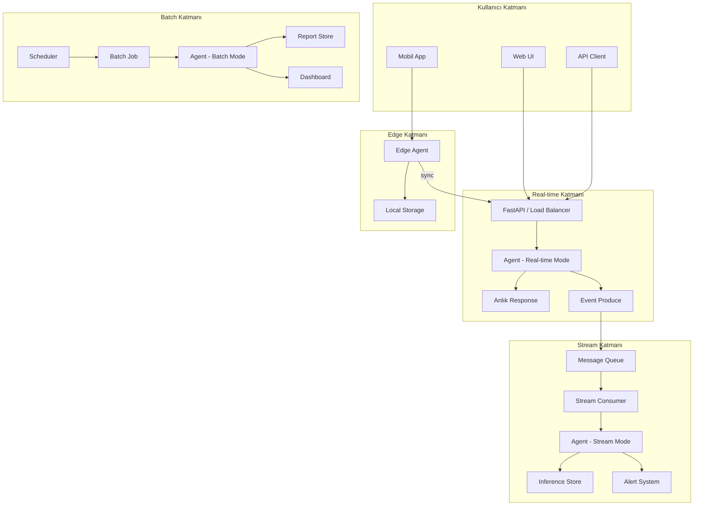

# Gerçek Sistemler Nasıl Hibrit Hale Gelir?

> Teoride 4 ayrı deployment modeli vardır. Pratikte çoğu production sistemi bunların bir kombinasyonudur.

---

## Neden Tek Model Yetmez?

Gerçek dünyada bir sistem büyüdükçe farklı ihtiyaçlar ortaya çıkar:

- Kullanıcı **anlık cevap** bekler → Real-time gerekir
- Yönetici **günlük rapor** ister → Batch gerekir
- Sistem **event'lere tepki** vermeli → Stream gerekir
- Bazı veriler **sunucuya çıkmamalı** → Edge gerekir

Tek bir deployment modeli tüm bu ihtiyaçları karşılayamaz.

---

## Tipik Evrim Yolculuğu

### Aşama 1: Monolith (Başlangıç)

```
[Kullanıcı] → [Tek API] → [Tek DB]
```

Her şey tek bir API'nin içinde. Ticket gelir, sınıflandırılır, kaydedilir. Basit ve çalışır.

**Sorun:** 1000 ticket/gün olunca API yavaşlar, raporlama istekleri gelir.

### Aşama 2: Batch Eklenir

```
[Kullanıcı] → [API] → [DB]
                          ↑
[Batch Job] ─── gece ─────┘ → [Rapor Store]
```

Raporlama ve enrichment için gece çalışan batch job'lar eklenir. API kullanıcıya cevap verir, batch geri kalan işi halleder.

**Sorun:** "Ticket oluşturulduğunda 1 dakika içinde doğru takıma atansın" isteği gelir.

### Aşama 3: Stream Eklenir

```
[Kullanıcı] → [API] → [DB] → [Event Bus]
                                    ↓
                              [Stream Consumer] → [Routing Logic]
                          ↑
[Batch Job] ─── gece ─────┘ → [Rapor Store]
```

Event-driven mimari eklenir. Ticket oluşturulduğunda event üretilir, stream consumer yakalar ve routing yapar.

**Sorun:** "Mobil uygulamada offline çalışmalı, veri sunucuya gitmemeli" isteği gelir.

### Aşama 4: Edge Eklenir

```
[Mobil Cihaz] → [Edge Agent] → [Lokal Sonuç]
                     ↓ (online olunca)
[Kullanıcı] → [API] → [DB] → [Event Bus]
                                    ↓
                              [Stream Consumer] → [Routing Logic]
                          ↑
[Batch Job] ─── gece ─────┘ → [Rapor Store]
```

Artık hibrit bir sistem var. Her katman farklı bir ihtiyaca cevap verir.

---

## Gerçek Dünya Hibrit Mimari Örneği



---

## Hangi Katman Ne İş Yapar?

| Katman | Sorumluluk | Latency | Öncelik |
|---|---|---|---|
| **Real-time** | Kullanıcıya anlık cevap | < 500ms | Kullanıcı deneyimi |
| **Stream** | Event'lere tepki, routing, enrichment | 1-30s | Operasyonel hız |
| **Batch** | Raporlama, bulk enrichment, analytics | Dakika-saat | İş zekası |
| **Edge** | Offline, privacy, ultra-düşük latency | < 50ms | Privacy / Offline |

---

## Hibrit Sistemin Zorlukları

### 1. Veri Tutarlılığı (Consistency)
Farklı katmanlar aynı veriyi farklı zamanlarda görür:
- Real-time: En güncel (request anı)
- Stream: Saniyeler gecikmeli
- Batch: Saatler gecikmeli
- Edge: Sync anına bağlı

**Çözüm:** Eventual consistency kabul et, her katmanın "freshness" beklentisini dokümante et.

### 2. Debugging
Bir ticket'ın yolculuğu 4 farklı katmandan geçebilir. Hata nerede oluştu?

**Çözüm:** Distributed tracing (correlation ID her katmanda taşınsın).

### 3. Deployment Koordinasyonu
Agent logic'i güncellediğinde 4 farklı yerde deploy etmen gerekir.

**Çözüm:** Shared library + versioned releases. Agent logic'i bağımsız paket olarak yönet.

### 4. Monitoring
4 farklı katmanın sağlığını tek yerden görmek gerekir.

**Çözüm:** Centralized monitoring (Prometheus + Grafana), her katman için dashboard.

---

## Büyük Şirketlerde Hibrit Örnekler

### Uber
- **Real-time:** Sürüş tahmin API'si (kullanıcı fiyat görür)
- **Stream:** Sürüş event'lerini gerçek zamanda işleme
- **Batch:** Günlük sürücü performans raporları
- **Edge:** Araç içi navigasyon (offline bölgelerde)

### Netflix
- **Real-time:** Öneri API'si (kullanıcı browse ederken)
- **Stream:** İzleme event'lerini gerçek zamanda işleme
- **Batch:** Gece model retraining
- **Edge:** CDN'de content delivery

### Slack
- **Real-time:** Mesaj gönderme/alma
- **Stream:** Bildirim event'leri
- **Batch:** Arama indeksi güncelleme
- **Edge:** Offline mesaj cache

---

## Öğrenme Çıkarımı

1. **Hiçbir sistem tek bir deployment modeliyle doğmaz.** Başlangıçta monolith, büyüdükçe hibrit.
2. **Agent logic'i deployment'tan ayırmak** hibritleşmeyi kolaylaştırır.
3. **Her katmanın farklı SLA'ı vardır.** Real-time'da 500ms, batch'te 6 saat — ikisi de "başarılı"dır.
4. **Consistency her yerde farklıdır.** Strong consistency gereken yerde real-time, eventual consistency yeten yerde batch kullan.
5. **Monitoring sayısı artar.** Hibrit sistemde observability en büyük yatırımdır.
