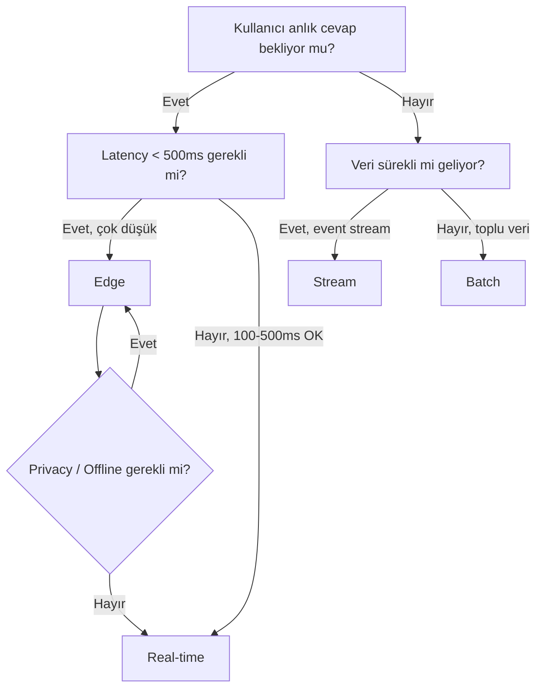

# Trade-offs: Her Deployment Modelinin Avantaj ve Dezavantajları

> Mühendislikte "en iyi" çözüm yoktur. Sadece "bu bağlamda en uygun" çözüm vardır.

---

## Kapsamlı Karşılaştırma

### Performans

| Metrik | Batch | Stream | Real-time | Edge |
|---|---|---|---|---|
| Latency | ❌ Yüksek (dk-saat) | ⚠️ Orta (sn) | ✅ Düşük (ms) | ✅ Çok düşük (ms) |
| Throughput | ✅ Çok yüksek | ✅ Yüksek | ⚠️ Orta | ❌ Düşük |
| Jitter | ✅ Yok (önemsiz) | ⚠️ Düşük | ⚠️ Değişken | ✅ Stabil |

### Operasyonel

| Metrik | Batch | Stream | Real-time | Edge |
|---|---|---|---|---|
| Karmaşıklık | ✅ Düşük | ⚠️ Orta-Yüksek | ⚠️ Orta | ❌ Yüksek |
| Debug Kolaylığı | ✅ Kolay (batch log) | ⚠️ Zor (event trace) | ⚠️ Orta (request trace) | ❌ Zor (cihaz log) |
| Deploy Kolaylığı | ✅ Basit | ⚠️ Queue yönetimi | ⚠️ Uptime gerekli | ❌ Cihaz yönetimi |
| Geri Alma | ✅ Kolay (yeniden çalıştır) | ⚠️ Replay gerekli | ❌ Zor | ❌ OTA update |

### Maliyet

| Metrik | Batch | Stream | Real-time | Edge |
|---|---|---|---|---|
| Compute Maliyeti | ✅ Düşük (off-peak) | ⚠️ Orta (sürekli) | ❌ Yüksek (her zaman) | ✅ Cihaz öder |
| Infra Maliyeti | ✅ Basit | ⚠️ Queue + Worker | ⚠️ LB + API + Scale | ❌ Cihaz + OTA |
| LLM API Maliyeti | ✅ Bulk indirim mümkün | ⚠️ Sürekli çağrı | ❌ Yüksek (her istek) | ✅ Lokal model (0 API) |

### Veri ve Güvenlik

| Metrik | Batch | Stream | Real-time | Edge |
|---|---|---|---|---|
| Veri Erişimi | ✅ Tam (bulk) | ⚠️ Event-scoped | ⚠️ Request-scoped | ❌ Sınırlı |
| Privacy | ⚠️ Merkezi veri | ⚠️ Event routing | ⚠️ API üzerinden | ✅ Lokal (veri çıkmaz) |
| Offline | ❌ Hayır | ❌ Hayır | ❌ Hayır | ✅ Evet |

---

## Karar Ağacı

### Basit Kurallar

1. **Veri toplu geliyorsa ve anlık cevap gerekmiyorsa → Batch**
2. **Veri sürekli akıyorsa ve düşük latency gerekiyorsa → Stream**
3. **Kullanıcı doğrudan etkileşim halindeyse → Real-time**
4. **Offline, düşük latency veya privacy kritikse → Edge**
5. **Emin değilsen → Real-time ile başla, ihtiyaca göre hibrite geç**

---

## Her Modelin "Kabusu"

Her deployment modelinin en kötü senaryosunu bilmek önemlidir:

### Batch'in Kabusu
- Gece çalışan job başarısız olur ve sabah kimse fark etmez
- 1M kayıt işlenirken ortada bir hata tüm batch'i durdurur
- Stale data: Sonuçlar üretildiğinde input zaten eskimiştir

### Stream'in Kabusu
- Consumer yetişemez (backpressure), queue şişer
- Duplicate event'ler işlenir (idempotency eksikliği)
- Event sırası bozulur (ordering guarantee yoksa)
- Dead letter queue büyür, kimse bakmaz

### Real-time'ın Kabusu
- LLM çağrısı timeout olur, kullanıcı bekler
- Spike trafik gelir, rate limit patlar
- Cold start: İlk istek yavaş gelir
- Hallucination: Yanlış cevap anlık verilir, geri alınamaz

### Edge'in Kabusu
- Model güncellenmesi gerekir ama cihaz offline
- Lokal model yetersiz kalır, fallback server'a ulaşamaz
- Cihazlar arası tutarsızlık (farklı model versiyonları)
- Debug: Hatayı cihazda yakalamak çok zor

---

## Production Anti-Pattern'leri

❌ **Her şeyi real-time yapmak**: Gerekmiyorsa batch daha ucuz ve basit
❌ **Stream'i batch gibi kullanmak**: Toplu işleme gerekiyorsa stream overhead'i gereksiz
❌ **Edge'i göz ardı etmek**: Privacy ve latency gereksinimlerini kaçırmak
❌ **Batch'i ignore etmek**: Raporlama ve enrichment için hala en iyi seçenek
❌ **Tek model seçmek**: Production sistemlerin çoğu hibrit
❌ **Monitoring koymamak**: Hangi model olursa olsun observability şart
