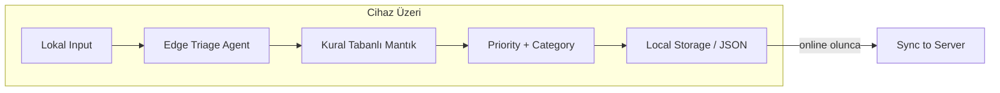

# Edge Deployment

> Cihaz üzeri, offline-capable, ultra-düşük latency ticket triage.

---

## Ne Zaman Edge Kullanılır?

- Privacy kritikse (veri cihazdan çıkmamalı)
- Offline çalışma gerekiyorsa
- Ultra-düşük latency gerekiyorsa (< 50ms, genellikle < 1ms)
- Internet bağlantısı güvenilir değilse
- API maliyetinden kaçınılmak isteniyorsa

## Mimari



## Çalıştırma

```bash
# Repo kök dizininden
python -m edge.app.local_agent

# Veya Makefile ile
make run-edge
```

## Diğer Modellerden Farkı

| Özellik | Batch/Stream/RT | Edge |
|---|---|---|
| LLM | Mock LLM (API simülasyonu) | Kural tabanlı (LLM yok) |
| Context | Full knowledge base | Sınırlı lokal cache |
| Storage | SQLite (inference store) | Lokal JSON dosyaları |
| Network | Gerekli | Gereksiz |
| Latency | 20-50ms (mock) | < 1ms |
| Confidence | LLM-based | Kural eşleşme oranı |

## Kural Tabanlı Mantık

Edge agent LLM kullanmaz. Bunun yerine:

1. **Priority Rules:** Anahtar kelime eşleştirmesi ile öncelik belirleme
2. **Category Rules:** Anahtar kelime eşleştirmesi ile kategori belirleme
3. **Team Mapping:** Kategori → takım ataması (sabit mapping)
4. **Confidence:** Eşleşen kural sayısına göre güven skoru

Gerçek dünyada edge'de şunlar kullanılabilir:
- Quantized model (TinyLlama, Phi-2)
- ONNX Runtime ile optimize model
- TF Lite / Core ML
- Veya bu örnekteki gibi kural tabanlı mantık

## Graceful Degradation

Edge agent'ın önemli bir özelliği: **bilinmeyen durumda güvenli fallback.**

```python
# Hiçbir kural eşleşmediyse:
priority = P2        # Orta (çok agresif veya pasif değil)
category = OTHER     # Belirsiz
confidence = 0.2     # Düşük → insana yönlendir
status = LOW_CONFIDENCE
```

Düşük confidence sonuçları, internet bağlantısı olduğunda sunucuya yollanıp tam LLM ile yeniden değerlendirilebilir.

## Local Storage + Sync

```
edge_results/
├── TICKET-001.json    ← Lokal sonuç
├── TICKET-002.json    ← Henüz sync edilmedi
└── TICKET-003.json    ← Online olunca sunucuya gider
```

`pending_sync()` methodu, sunucuya henüz gönderilmemiş sonuçları listeler.

## Trade-offs

**Avantajlar:**
- Sıfır network bağımlılığı
- Ultra-düşük latency (< 1ms)
- Tam privacy (veri cihazda kalır)
- Sıfır API maliyeti
- Hallucination riski çok düşük (kural tabanlı)

**Dezavantajlar:**
- Sınırlı zeka (kural tabanlı → yeni pattern'ler yakalanmaz)
- Model güncelleme zorluğu (OTA)
- Cihazlar arası tutarsızlık riski
- Debug çok zor (cihaz loglarına erişim)
- Karmaşık vakaları çözemez
