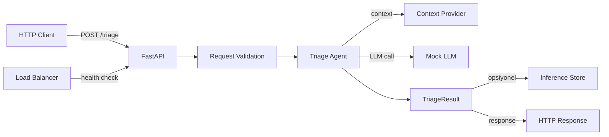

# Real-time Deployment

> HTTP API üzerinden anlık ticket triage — kullanıcı sorar, agent anında cevap verir.

---

## Ne Zaman Real-time Kullanılır?

- Kullanıcı doğrudan etkileşim halindeyse
- Anlık cevap gerekiyorsa (< 500ms ideal)
- Request/response pattern uygunsa
- Chatbot, form auto-fill, inline suggestion gibi senaryolarda

## Mimari



## Çalıştırma

```bash
# Repo kök dizininden
python -m realtime.app.api

# Veya Makefile ile
make run-realtime

# API dokümanı
# http://localhost:8000/docs (Swagger UI)
# http://localhost:8000/redoc (ReDoc)
```

## Örnek İstek

```bash
curl -X POST http://localhost:8000/triage \
  -H "Content-Type: application/json" \
  -d '{
    "ticket_id": "TICKET-1234",
    "title": "Login page returns 500",
    "body": "When I try to login with Chrome, I get a 500 error.",
    "user_email": "user@example.com"
  }'
```

## Endpoints

| Method | Path | Açıklama |
|---|---|---|
| POST | `/triage` | Ticket'ı analiz et, sonucu döndür |
| GET | `/health` | Health check (load balancer için) |
| GET | `/results/{ticket_id}` | Önceki sonucu sorgula |
| GET | `/docs` | Swagger UI |

## Trade-offs

**Avantajlar:**
- En düşük latency (kullanıcı deneyimi)
- Standart HTTP — kolay entegrasyon
- Swagger/OpenAPI otomatik dokümantasyon
- Stateless — kolay horizontal scale

**Dezavantajlar:**
- Her zaman çalışır → yüksek maliyet
- LLM timeout riski → kullanıcı bekler
- Spike trafik → auto-scale veya rate limit gerekli
- Hallucination riski → cevap anında gider, geri alınamaz

## Production'da Ne Değişir?

| Bu Repo | Production |
|---|---|
| Mock LLM (50ms) | Gerçek LLM (200-2000ms) |
| CORS allow_all | Strict origin policy |
| Auth yok | JWT/API key authentication |
| Rate limit yok | Token bucket / sliding window |
| Tek instance | Load balancer + auto-scale |
| SQLite store | PostgreSQL + Redis cache |
| stdout logging | Structured logging + APM |
