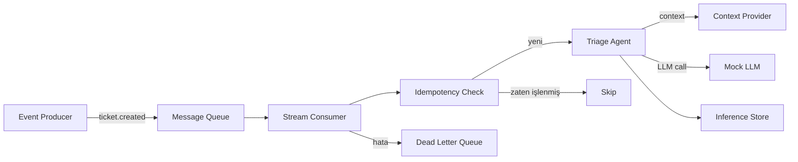

# Stream Deployment

> Event-driven mimari ile ticket'ları birer birer tüket ve işle.

---

## Ne Zaman Stream Kullanılır?

- Veri sürekli akıyorsa (event bus, webhook)
- Her event'e hızlı tepki gerekiyorsa (saniyeler)
- Decoupled mimari isteniyorsa (producer ≠ consumer)
- Ölçeklenebilirlik partition/consumer bazlı yapılacaksa

## Mimari



## Çalıştırma

```bash
# Repo kök dizininden
python -m stream.app.consumer

# Veya Makefile ile
make run-stream
```

## Dosya Yapısı

```
stream/
├── app/
│   ├── __init__.py
│   └── consumer.py       # Event consumer + simüle queue
├── tests/
│   └── test_stream.py    # Stream testleri
├── Dockerfile
└── README.md
```

## Önemli Kavramlar

### Idempotency
Aynı event birden fazla gelirse (at-least-once delivery), ticket tekrar işlenmez.
`store.exists(ticket_id)` kontrolü ile sağlanır.

### Dead Letter Queue (DLQ)
Tüm retry'lar başarısız olursa event DLQ'ya gider. Bu event'ler
mühendisler tarafından incelenir ve manuel müdahale ile çözülür.

### Backpressure
Consumer yetişemezse queue şişer. Production'da:
- Consumer sayısını artır (horizontal scale)
- Rate limit uygula
- Alert kur

### Acknowledge (Ack)
Event başarıyla işlendikten sonra broker'a "işledim" sinyali gönderilir.
Ack edilmeyen event'ler broker tarafından tekrar gönderilir.

## Trade-offs

**Avantajlar:**
- Düşük latency (saniyeler)
- Decoupled mimari (producer/consumer bağımsız scale)
- Event replay mümkün
- Doğal ölçeklenme (partition + consumer group)

**Dezavantajlar:**
- Karmaşık altyapı (queue yönetimi)
- Debug zor (distributed tracing gerekli)
- Ordering garantisi zor
- İşlenemeyen event'ler birikin (DLQ yönetimi)
